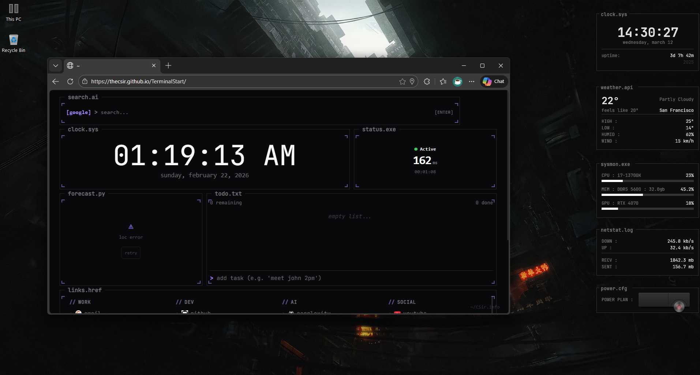
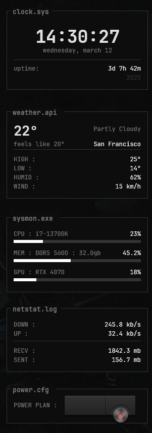

# TerminalRainmeter

A collection of Rainmeter skins with a unified terminal/hacker aesthetic. Dark theme, monospace fonts, TUI-style borders — designed to match the TerminalStart look.

## Screenshots






## Skins

### Clock (`clock.sys`)

Minimal clock widget displaying:

- Current time (24h, large)
- Date (day of week + full date)
- System uptime
- Year

### PowerOpt (`power.cfg`)

Power plan quick-switcher with animated expand/collapse. Switch between:

- **Eco** — Power saver
- **Balanced** — Default Windows plan
- **High Perf.** — High performance
- **Turbo** — Ultimate performance
- **Settings** — Opens Windows power settings

### SysMon (`sysmon.exe`)

Real-time system monitor displaying:

- CPU usage with hardware name, percentage, and horizontal bar
- RAM usage with DDR type, speed, total GB, percentage, and horizontal bar
- GPU usage with model name, percentage, and horizontal bar

### NetStat (`netstat.log`)

Network activity monitor showing:

- Download speed (KB/s)
- Upload speed (KB/s)
- Session totals (RX / TX in MB)

### NowPlaying (`media.pid`)

Now Playing widget with media controls:

- Source indicator (Spotify, WMP, foobar2000, etc.) + play state
- Track title and artist (idle state when nothing is playing)
- 10-band segmented pixel equalizer (AudioLevel FFT)
- Progress bar with position / duration
- Playback controls: previous, play/pause, next

> Configure the player by editing the `Player` variable in `NowPlaying.ini` (default: `Spotify`).
> Supported values: `Spotify`, `CAD`, `WMP`, `iTunes`, `WinAmp`, `AIMP`, `foobar2000`

### Weather (`weather.api`)

Live weather widget using wttr.in API:

- Current temperature (large) and condition
- Feels like temperature and city name
- High / Low temperatures
- Humidity and wind speed

## Theme

All skins share a consistent dark terminal palette:

| Token      | Value             |
|------------|-------------------|
| Background | `rgb(13,13,13)`   |
| Foreground | `rgb(224,224,224)` |
| Muted      | `rgb(119,119,119)` |
| Border     | `rgb(51,51,51)`   |
| Accent     | `rgb(255,255,255)` |
| Font       | JetBrains Mono    |

## Folder Structure

```
TerminalRainmeter/
├── RMSKIN.ini
├── TerminalRainmeter/
│   ├── Clock/
│   │   └── Clock.ini
│   ├── NetStat/
│   │   └── NetStat.ini
│   ├── NowPlaying/
│   │   └── NowPlaying.ini
│   ├── PowerOpt/
│   │   ├── PowerOpt.ini
│   │   └── *.png
│   ├── SysMon/
│   │   ├── SysMon.ini
│   │   └── GetRAMSpeed.vbs
│   └── Weather/
│       └── Weather.ini
└── README.md
```

## Installation

1. Install [Rainmeter](https://www.rainmeter.net/)
2. Install [JetBrains Mono](https://www.jetbrains.com/lp/mono/) font
3. Download the `.rmskin` file from the latest release and double-click to install
4. Or copy the `TerminalRainmeter/` folder into your Rainmeter Skins directory (typically `Documents\Rainmeter\Skins\`)
5. Load the skins from the Rainmeter manager
